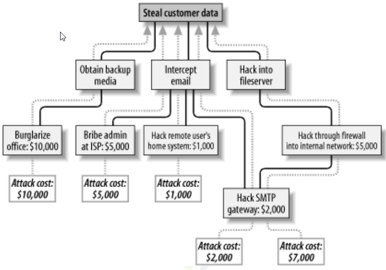
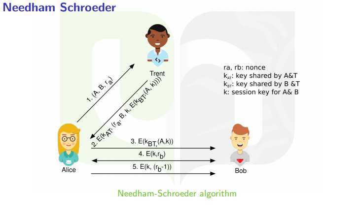
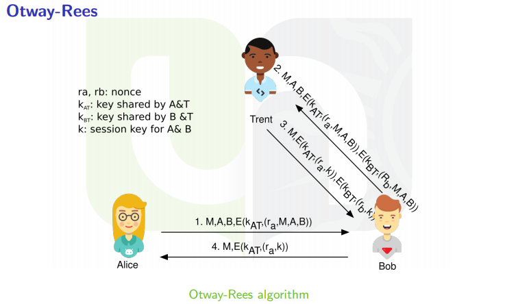

L’évaluation se tiendra à distance suivant les modalités suivantes:

* Il s’agira d’un examen en ligne, piloté au travers de la plateforme WebCampus. Il vous faudra donc être connecté(e) sur la plateforme durant tout l’examen et avoir réussi l’examen blanc proposé par la cellule TICE (les détails concernant cet examen blanc suivront)
* La date de l'examen sera confirmée sous peu par le secrétariat facultaire
* Chacun(e) devra être connecté(e) sur Teams durant la durée de l’examen; cela permettra le cas échéant pour vous, de poser des questions, et pour moi, de m’assurer que tout se déroule correctement
* L’examen sera un mélange de questions fermées (QCM, appariement…) et de questions ouvertes. Il s’agit de tester à la fois vos connaissances et vos compétences ainsi que votre capacité de raisonnement. 
* En particulier, vous serez confronté(e)s à une analyse de cas similaire à celle que je vous ai proposée dans le chapitre sur l’analyse de risques
* L’examen se fera à livre ouvert
* De manière générale, l’épreuve consistera à mobiliser les outils et approches vus au cours pour répondre à une situation concrète. Vous pouvez donc vous attendre à devoir effectuer une analyse sommaire des risques sur base d’un cas, et de proposer des solutions appropriées, ces solutions relevant potentiellement des différents chapitres du cours. Les attentes chapitre par chapitre sont détaillées à la fin de ce message.

Comme communiqué au début du cours, l’examen interviendra pour 60% dans la note finale, et les travaux pratiques que vous avez réalisés compteront pour 40%.Je suis conscient que ce mode d’évaluation risque d’être un peu déroutant. Je vous rassure, l’examen ne sera pas plus compliqué que lors des sessions précédentes. Si vous avez la moindre question ou que vous anticipez la moindre difficulté, n’hésitez à m’en faire part, nous trouverons des solutions. En attendant, prenez soin de vous, je reste joignable par les moyens habituels (Teams, email)Jean-Noël Colin 

**Attentes détaillées chapitre par chapitre**

## Chapitre 1 et 2: Introduction et Méthodologie.

### Connaitre les critères de sécurité.

* **Confidentialité**: Information non accessibles aux individus/entités non autorisés, et ce dans le stockage, l'échange ou le traitement.
* **Intégrité:** Propriété de la précision et de l'accomplissement. Par exemple: dans le stockage, l'échange et le traitement.
* **Disponibilité:** Fait d'être accessible et utilisable à la demande par une entité autorisée.
* **Authenticité:** Vérification qu'une entité est bien celle qu'elle prétend être.
* **Responsabilité:** Les actions peuvent être tracées jusqu'aux entités d'origines.
* **Non-répudiation:** Capacité de prouver qu'une action a bien été perpétrée par une entité.
* **Fiabilité:** Propriété d'un comportement consistant (resultat cohérant et attendu).

### Connaitre les concepts et le déroulement d’une analyse de risques.

**Deux approche:**  
* **Basé sur le risque:** Comprendre, identifié, evaluer, décider, planifier, prioriser, réagir, communique, **ETABLIR ET MAINTENIR UNE CONNAISSANCE DE BASE**   
* **Basé sur la structure:** Définir un vocabulaire commun, une structure claire et procéder, aide à faire une analyse le plus exhaustive possible, assurer la continuité d'une application, améliorer le processus lui-même   
**Qu'est ce qu'un processus?**  
* **Itératif:** Ré-évaluer le système, l’environnement, les choix précédant périodiquement  
* **Récursif:** Evaluer le système, puis ses composant, etc
* **Supporté:** Par beaucoup de méthodes : différents niveaux de complexités et de contexts
Nombreuses méthodes déjà existantes (Octave, CRAMM, EBIOS, Mehari)

### Déroulement: 

**1.Établir le contexte:** Définir les objectifs et le périmètre du processus, pour s’assurer que tous les éléments importants soient pris en compte et que les risques qui pourraient survenir sont correctement identifiés. C’est aussi définir une approche de gestion des risques et des critères basiques:  
* *Critères d’évaluation des risques:* basés sur la valeur des atouts, les obligations légales, et l’importance opérationnelle et business de la disponibilité et de l’intégrité.  
* *Critères d’évaluation de l’impact:* pour exprimer et mesurer le degré de dégâts ou coûts que chaque risque peut provoquer. Il y a plusieurs dimensions : continuité de l’entreprise, dégâts sur la réputation, non respect d’obligations légales ou contractuelles, etc.  
* *critères d’acceptation des risques:* pour identifier le niveau acceptable de risque. Il faut également bien s’organiser pour cette gestion des risques : définir les rôles et responsabilités, définir des procédures de communication, etc.

**2.Identification des risques:** l’objectif est de comprendre ce qui pourrait causer une perte potentielle (d’atouts), et où et pourquoi cette perte pourrait survenir. Il faut donc identifier : 
* *Les atouts:* atouts primaires (processus, informations, connaissances), secondaires (infrastructure, logiciels, bâtiments, personnel), savoir à qui appartient quel atout.
* *Les menaces:* à partir de listes existantes de menaces, de rapports d’incidents, d’avis d’experts, etc. 
* *Les contrôles:* (de sécurité) déjà existants 
* *Les vulnérabilités:* à différents niveaux : environnement, personnel, procédures, infrastructures, logiciels, parties tierces… 
* *Les impacts:* financiers, de réputation, perte de temps…   

**3.Analyse des risques:** on peut avoir un approche qualitative (ex : risque faible, moyen, fort, ou utiliser une échelle de 1 à 10 : c’est facile à comprendre mais subjectif) ou quantitative (valeurs numériques dérivées de modèles, mais c’est difficile d’avoir des données précises). Il faut également évaluer les conséquences ainsi que la probabilité de chaque risque.  

**4.Évaluation des risques:** à partir des critères d’acceptation des risques et de la liste des risques, il faut identifier les risques qu’il faut mitiger et prioriser leur traitement.  

**5.Traitement des risques:** on peut modifier les risques, les éviter (pas souvent possible), les partager (le donner à quelqu’un d’autre, ex : prendre une assurance pour éviter de devoir trop payer en cas d’accident de voiture). Le traitement se fait en fonction du coût de traitement de chacun des risques et du bénéfice que ce traitement peut apporter.  

**6.Acceptation des risques** approbation formelle (par le management) du plan d’action et des risques résiduels.  

**7.Communication des risques:** échanger les informations concernant les risques (existence, nature, importance, traitement…) avec le management et les parties prenantes.  

**8.Monitoring/surveillance des risques:** surveiller les risques et leurs facteurs pour identifier des changements dans le contexte de l’entreprise et pouvoir donner une réponse à ces changements.  

  
### Les moyens de mesurer le risque et ses composantes, les options de traitement du risques, les lignes de défense (prévention, détection, récupération)

* **Pouvoir effectuer une analyse de risques sommaires et proposer un plan d’action concret, approprié, réaliste sur base de l’analyse réalisée. Ce plan d’action doit se décliner selon les différentes lignes de défense**  
* **Pouvoir produire un arbre d’attaque crédible**  
Technique proposée par Bruce Schneier, consiste à modéliser les attaques possibles et les conditions d’occurrence, en décomposant les objectifs d’attaques en sous-objectifs, récursivement. Exemple : On peut assigner à chaque nœud une valeur possible (P) ou impossible (I), une valeur donnant la difficulté d’un vecteur d’attaque, son coût, etc. Cela permet de voir quel est le coût d’une attaque, quelle est l’attaque la plus probable, et donc ce qu’il faut protéger en premier. 

## Chapitre 3 :Cryptographie
  * **Connaitre les différentes primitives cryptographiques: chiffrement, empreinte numérique, signature numérique et certificat numérique, les objectifs de sécurité liés, les contraintes de mise en oeuvre...**  
  
  *Cryptographie:* science de la création d’algorithmes (ciphers) de (dé)chiffrement.   
  *Cryptanalyse:* science consistant à casser des algorithmes de chiffrement.   
  *Cryptologie:* étude des algorithmes (création + les casser) : cryptographie + cryptanalyse

  **Chiffrement de César:**  
  Décaler les lettres du message original (ex : A devient D, B devient E, etc). On peut généraliser cette technique en substituant chaque lettre par une autre (ex : A devient D, B devient A, etc). Mais ces deux techniques sont faciles à casser, par exemple en analysant la fréquence de chaque lettre (en français, la lettre E apparaît plus souvent, et donc la lettre qui remplace la lettre E sera probablement celle qui apparaît le plus souvent dans le message codé).
  
  **Chiffrement de Vigenère:**  
  Substitution polyalphabétique : une même lettre du message clair peut, suivant sa position dans le message, être remplacée par des lettres différentes (contrairement au chiffrement de César par exemple). La i-ème lettre du message chiffré est égale à la i-ème lettre du message en clair avec un décalage de : la i-ème lettre de la clé répétée ( ex : keykeykeyke…) modulo 26.
  
  **Pourquoi ne pas uniquement utiliser un algorithme (au lieu d’utilisé une clé secrète en plus)?**
  C’est plus difficile de garder un algorithme secret, une fois qu’il est connu il devient inutilisable, il faut faire confiance au créateur de l’algorithme. Alors qu’il est plus facile de garder une clé secrète, que si l’algorithme est public, il peut être validé par de nombreux experts, on peut même utiliser plusieurs clés.
  
  * *Principe de Kerckhoff* : un système cryptographique doit être sécurisé même si l’ensemble du système est connu, mis à part la clé privée.
  
  **Différente classes d'attaques**  
  Attaques passives (espionnage, pas d’interaction entre l’attaquant et les parties qui communiquent, attaque difficile à détecter), actives (usurpation d’identité (id spoofing), modification de la communication (ajout, modification ou suppression de paquets)… Ex : man in the middle), attaque par rejeu (renvoyé un message émit précédemment), attaque par canal auxiliaire (attaque basée sur de l’information provenant de l’implémentation physique du mécanisme cryptographique, plutôt que via sa cryptanalyse. Ex : se baser sur la consommation énergétique ou les émissions électromagnétiques de l’algorithme), attaque liée au timing (déterminer des informations sur le processus cryptographique sur base du temps qu’il prend).  
  
  *On peut attaquer la clé:* à voir en fonction de la taille de la clé (40 bits → 10¹², 56 bits → 64*10¹⁵, mais il y a des clés de 128, 256, 4096 bits!), on peut faire du brute force (en moyenne, on essaie la moitié des possibilités → ajouter un bit à la clé double le temps nécessaire pour un brute force), ou une attaque par dictionnaire (se baser sur une liste de valeurs probables).  
  
  *On peut attaquer l’algorithme:* l’objectif est alors de trouver la clé plus rapidement que via un brute force. Différents types d’attaques, en fonction de ce que l’on sait connaître : soit on a uniquement accès à un texte chiffré, soit on a accès à des paires de textes chiffrés et déchiffrés, soit on peut obtenir le texte chiffré correspondant à n’importe quel texte déchiffré, soit on peut connaître le texte déchiffré correspondant à n’importe quel texte chiffré (en connaissant la clé).
  
  **Un bon algorithme de chiffrement** ne doit pas permettre à un attaquant de trouver la clé, ne doit pas permettre à un attaquant de récupérer tout ou une partie du texte en clair, ni aucune propriété du texte en clair (ex : sa longueur précise). Formellement : la probabilité de trouver le texte en clair en connaissant le texte chiffré doit être égale à la probabilité de trouver le texte en clair sans connaître ce texte chiffré.  
  
  *Les nombres aléatoires* sont la base de nombreux mécanismes de cryptographie : génération de clés, de nonces (nonce : nombre arbitraire destiné à être utilisé une seule fois)… Il faut donc disposer d’un générateur de nombres pseudo-aléatoires (PRNG), se basant sur une graine (seed) réellement aléatoire. Pour obtenir cette graine, on peut se baser sur des phénomènes matériels (bruit thermique des résistances, turbulences d’air dans le disque dur…) ou sur du logiciel (horloge, mouvements de la souris, paramètres du système d’exploitation…). Un générateur de nombres pseudo-aléatoires se base sur un algorithme déterministe, il génère une séquence de nombres qui ont l’air aléatoires sur base d’une graine réellement aléatoire.
  
  ### Cryptographie symétrique  
  **ECB** – Electronic CodeBook Mode : simplement les juxtaposer. En faisant cela, les blocs identiques seront chiffrés de la même manière et on les remarque facilement.  
  **CBC** – Cipher Block Chaining : pour chaque bloc à chiffrer, on fait un XOR avec le texte chiffré du bloc précédent avant de réaliser le chiffrement du bloc (et pour le premier bloc on fait le XOR avec une constante que l’on transmet en clair avec le message).  
  **CFB** – Cipher FeedBack Mode : pour chaque bloc à chiffrer, on fait un XOR avec Ek(bloc chiffré précédent), et on obtient directement le bloc chiffré.  
  **CTR** – Counter Mode : pour chiffrer un bloc, on fait un XOR avec Ek(nonce || x), où x est le numéro du bloc à chiffrer, et nonce un nombre aléatoire.
  * Cette technique permet la parallélisation (on peut chiffrer plusieurs blocs en même temps car un bloc ne dépend pas du précédent) et permet de déchiffrer seulement une partie du message (car les blocs sont indépendants).  
  
  **Padding** : si la taille des données n’est pas un multiple de la taille d’un bloc, comment compléter les données pour que le destinataire sache à partir de quand ce ne sont plus des données dans le message en clair : on peut par exemple compter le nombre de bytes qu’il faut rajouter, et écrire cette valeur de manière répétée sur ces bytes à compléter. Le destinataire n’a qu’à lire le dernier byte, il obtient le nombre de bytes qu’il doit supprimer du message. 
  
  ### Methodes de chiffrement:
  
  * **Méthode de chiffrement – bloc à usage unique:**  
  Cette méthode est basée sur l’utilisation unique d’un flux aléatoire de données (k) faisant la même taille que les données à chiffrer. Chiffrement : c = p XOR k, et déchiffrement : p = c XOR k. Malheureusement la gestion des clés est alors complexe (il faut changer la clé à chaque fois et elles sont grandes), cette méthode n’est donc pas utilisable en pratique  
  
  * **Méthode de chiffrement – chiffrement de flux:**
  Cette méthode est inspirée de la précédente (bloc à usage unique), on a un générateur de nombres aléatoires qui génère une séquence de bits, et le chiffrement/déchiffrement fonctionne un bit à la fois : c = p XOR pad, p = c XOR pad. Il faut que le générateur soit cryptographiquement sécurisé et correctement initialisé.  
  
  * **Méthode de chiffrement – DES – Digital Encryption Standard:**
  utilise une clé de 56 bits, un chiffrement par blocs de 64 bits, utilise la même fonction pour chiffrer et déchiffrer. L’objectif de cette méthode est que chaque bit du texte chiffré dépende de chaque bit du texte clair et de la clé, et soit aussi rapide que possible. L’algorithme effectue 16 tours (round), en utilisant des clés dérivées de la clé principale (via des permutations et compressions). L’algorithme est plutôt lent, et n’est plus sécurisé (crackable très rapidement).  
  
    * *Triple DES:* Effectuer le chiffrement DES 3 fois, avec 3 clés différentes (donc 168 bits au total). C’est donc 3 fois plus lent que DES.
    * *AES – Advanced Encryption Standard:*: Chiffrement par blocs de 128 bits, avec des clés de 128, 192 ou 256 bits.
    * *RC4:* Méthode de chiffrement utilisé pour la sécurité WiFi « WEP », était censée être secrète (mais s’est retrouvée sur internet), la clé est de longueur variable, et cette méthode génère des séquences aléatoires sur base de la clé, que l’on XOR avec le texte pour le chiffrer. Cette méthode utilise une boite de substitution, qui est mise à jour après chaque utilisation.
  
  ### Gestion des clés:
  La gestion des clés comprend la gestion des créations, expirations, révocations, envoi et stockage des clés, ainsi que la gestion des menaces : perte, vol, compromission, extorsion… Il peut potentiellement y avoir beaucoup de clés : par exemple si on a n personnes, il faut n*(n-1)/2 clés pour que chacune puisse communiquer individuellement avec toutes les autres, et si on veut pouvoir avoir des communications de groupe, il en faudrait encore plus. Et c’est plus facile pour un attaquant de voler une clé que de casser un chiffrement.  
  
  **Durée de vie d’une clé:** Plus elle est utilisée, plus elle a de chance d’être compromise, plus l’impact d’une compromission sera grand (car la clé aura servi à encoder beaucoup de messages), plus elle sera intéressante pour des attaquants et plus la cryptanalyse sera facile. Il faut donc bien définir la durée de vie de chaque clé, et il faut trouver un compromis entre le coût de gestion des clés et l’impact en cas de compromission.  
  
  **Génération des clés:** Il faut une manière sécurisée de les générer (ne pas avoir un espace restreint par exemple), elles doivent être aléatoires, suffisamment longues et doivent être régénérée périodiquement.
  
  **Mise à jour des clés:** On peut par exemple calculer la clé suivante à partir de la clé actuelle (kt+1 = f(kt)) en utilisant une fonction non inversible, mais la sécurité de la nouvelle clé dépend directement de la sécurité de la précédente  
  
  **Destruction des clés:** Sans destruction, il sera toujours possible de l’utiliser. Il faut donc une destruction sécurisée (partout où elle a été stockée : documents, fichiers, mémoire de l’ordinateur…).  
  
  **Stockage des clés:** Il faut les garder en sécurité des attaquants, par exemple sur un média que l’on peut déconnecter (clé usb, baque, carte de banque).  
  
  **Échange de clés:** On peut utiliser une autre clé (kek – Key-Encryption Key) pour chiffrer les clés que l’on souhaite échanger (dk – Data Keys), mais il faut alors distribuer manuellement les kek avec un haut niveau de sécurité. On peut aussi découper la clé et envoyer chaque partie d’une manière différente (en espérant que l’attaquant n’a pas accès à tous les canaux utilisés). On peut enfin utiliser un centre de distribution de clés (KDC – Key Distribution Center), qui sera alors un tiers de confiance : ce tiers connaîtra toutes les clés, et est un spoc (single point of failure).
  
  **Partage de clés avec des tiers:** On peut simplement donner une copie de la clé à un tiers de confiance. On peut aussi découper la clé en différentes parties et donner les parties à des personnes différentes. On peut aussi utiliser un appareil de récupération de la clé, que l’on peut transmettre en cas d’absence.  
  
  **Propriétaire/détenteur des clés:** Il faut pouvoir être sûr qu’une clé donnée appartient bien à la personne que l’on souhaite contacter : soit en échangeant la clé en face à face, en utilisant un canal déjà sécurisé avec la personne, ou en utilisant un tiers de confiance.  
  
  **Compromission des clés:** Comment détecter une compromission ? On ne le détecte généralement pas tout de suite. Il faut utiliser un maximum de clés différents pour minimiser l’impact d’un vol de clé.
  
  ### Cryptographie asymétrique  
  Cryptographie asymétrique (=cryptographie à clé publique) : la clé de chiffrement est différente de la clé de déchiffrement : c = E(k1, p) et p = D(k2, c). k1 et k2 sont différents mais sont mathématiquement liées. Ce qui est chiffré avec k1 ne peut être déchiffré qu’avec k2 et vice-versa. Le principe est de rendre une de ces 2 clés publique (K+ ) et de garder l’autre secrète (K- ).  
  
  **Principes de base:**  
  on se base sur une fonction f à sens unique : c’est facile de calculer y = f(x) mais difficile de calculer x = f-1(y), sauf si on connaît « l’indice » (matérialisé par K- ). La fonction est difficile à inverser et il est difficile de dériver K- à partir de K+ . C’est basé sur la théorie des nombres complexes : factorisation de grands nombres, logarithmes discrets, courbes elliptiques… C’est plus pratique que la cryptographie symétrique pour la gestion des clés (on peut donner la clé publique à tout le monde, et la protection de la clé privée est de la seule responsabilité du propriétaire de la clé), mais c’est plus lent de chiffrer/déchiffrer un message.
  
  **Algorithme RSA:**  
  inventé par R. Rivest, A. Shamir et L. Adleman en 1978, cette technique se base sur la factorisation de grands nombres. Génération d’une paire de clés :
  1. choisir deux grands nombres premier aléatoires p et q, et calculer n = p*q 
2. calculer φ(n) = (p-1)(q-1) 
3. choisir un exposant e tel que e < n et que e et φ(n) sont premiers entre eux 
4. calculer d tel que d*e = 1 + k* φ(n) (où k appartient aux naturels) 
5. K + = (n, e) et K- = (n, d).  

    → Généralement, p et q font chacun plus de 1000 bits. 
    
**Algorithme d’El Gamal:**  
Se base sur le principe de Diffie-Hellman et sur le problème du logarithme discret : c’est facile de calculer y = ax mod n, mais difficile de trouver x

### Signature numérique (digital signature)  
Objectifs d’une signature numérique : authentification, et non répudiation. Ces signatures se basent sur la cryptographie asymétrique, et on utilise la clé privée pour signer un certificat.  

**Il faut d’abord générer un « résumé » du message (« message digest »):** un hash. L’idée est de générer un résumé de longueur fixe (et petite), unique et qui a l’air aléatoire, pour n’importe quelle donnée. Il faut pour cela une fonction (de hash) qui n’est pas inversible, qui prend n’importe quel input (peu importe la longueur), qui renvoie un output de longueur fixe, qui a l’air aléatoire, qu’il ne soit pas facilement possible de trouver 2 données ayant le même hash. Et il faudrait qu’un petit changement de l’input ait un impact sur l’ensemble de l’output (du hash). Exemples :  
•	MD2 : hash de 128 bits, obsolète, on a trouvé des faiblesses à cet algorithme et des collisions. 

•	MD5 : hash de 128 bits, obsolète, plus rapide et plus résistant que MD2, on a trouvé des faiblesses, mais pas de collisions.

•	SHA-1 : pour des messages de longueur inférieure à 2 ⁴ bits. Obsolète, hash de 160 bits, ⁶ possibilités). faiblesses et collisions trouvées. 

•	SHA-2 et SHA-3 : résistants à la cryptanalyse.

**On utilise ensuite le hash du message pour vérifier l’intégrité du message:**  

•	HMAC – Hash Message Authentification Code : supposons que A et B connaissent tous les deux une clé secrète k. A calcule h = H(f(k,p)) (où H est une fonction de hachage et f une fonction qui mélange k et le message p). A envoie ensuite p et h à B. B peut lui aussi calculer H(f(k, p)), et vérifier si le résultat est bien identique au « h » qu’il a reçu.
i.	La fonction f ne doit pas être bêtement « f(k, p) = concat(k, p) », sinon comme f est connue, cela pourrait permettre de trouver k.
ii.	Cette méthode ne règle pas le problème de l’authentification 

•	Signature numérique basée sur la cryptographie asymétrique : A calcule h = H(p), puis utilise sa clé privée pour chiffrer h : signatureA = E(KA - , h), et envoie p et signatureA à B. B peut déchiffrer signatureA à l’aide de la clé publique de A : h’ = D(KA + , signatureA), et calculer h’’ = H(p), et vérifier si h’ == h’’. Si c’est le cas, c’est que le message p n’a pas été modifié, et qu’il a bien été envoyé par A. 
i.	Contrairement à une signature réelle (manuscrite), 2 messages signés avec la même clé auront 2 signatures différentes, et un message signé avec 2 clés différentes aura 2 signatures différentes. Il n’est donc pas possible de copier la signature d’un message pour un autre message.
ii.	DSA – Digital Signature Algorithm : se base sur le problème des logarithmes discrets, utilise SHA-1 comme algorithme de hash. 

**Exemple:**
horodatage certifié (trusted timestamping) : système permettant de garder la preuve de l’existence d’un document et de son contenu à une date donnée, en se basant sur une autorité de certification. Fonctionnement :   
1. Le client calcule le hash de son document (h : H(document), et l’envoie à l’autorité d’horodatage. 

2. L’autorité d’horodatage mélange le hash reçu (h) au timestamp actuel (via une fonction connue), et calcul le hash de ce mélange (h2 = H(h, timestamp)). L’autorité va ensuite chiffrer ce hash à l’aide de sa clé privée : cert = E(Kautorité, h2), et renvoyer « cert » et le timestamp au client. 

3. Si on possède le document, le certificat et le timestamp, on sait vérifier que le certificat est valide (et que le document donné correspond bien au document lié au certificat) : on calcule le hash du document, on le mélange au timestamp, on hash le résultat, et on vérifie que ce hash correspond bien à celui stocké dans le certificat en déchiffrant le certificat avec la clé publique de l’autorité de certification (K+ autorité) 

### Infrastructure de clés publiques   

  Certificats numériques : se basent sur la cryptographie asymétrique et permettent d’établir une relation vérifiable (prouvable) entre une clé publique et l’identité de son propriétaire (une personne ou un système). 
  
  **Certificat X.509:**  
  Un certificat numérique. Il est fournit par un tiers de confiance : une autorité de certification. Cette autorité signe numériquement le certificat, pour l’authentifier. Le certificat identifie le sujet (une personne/un système) et l’émetteur en utilisant une notation précise. Le certificat possède également une date de début et de fin de validité.  
  Il y a eu plusieurs évolutions des certificats X.509 (v1, v2, v3). Un certificat contient les informations suivantes : la version du certificat, un numéro de série, le nom de l’algorithme de signature, le nom de l’émetteur, la période de validité, le nom du sujet, la clé publique du sujet, l’identifiant unique de l’émetteur, l’identifiant unique du sujet, la signature du certificat, et des extensions (identifiant de la clé de l’autorité, contraintes basiques, contraintes de noms, etc).  
  Pour pouvoir valider la signature d’un certificat, il faut la clé publique de l’émetteur de ce certificat. L’émetteur (une autorité de certification) auto-signe son certificat (il le signe avec sa propre clé privée). Attention qu’un certificat n’authentifie pas son porteur : il faut d’abord vérifier que le sujet connaît la clé privée correspondant à la clé publique qui se trouve dans le certificat (on peut faire cela en envoyant une information chiffrée avec la clé publique du sujet, et en demandant au sujet de renvoyer cette information déchiffrée).  
  
  La gestion des certificats est réalisée par un ensemble d’entités qui forment **une PKI – Public Key Infrastructure. Une PKI est composée** :  
  * D’une autorité de certification – CA : elle authentifie les sujets, crée, gère et révoque les certificats (CSR – Certificate Signing Request), elle rend sa propre clé publique disponible (via un certificat, signé avec sa propre clé privée). En pratique, elle utilise une chaîne de certificats (un certificat principal auto-signé – certificat racine, et des certificats intermédiaires signés avec la clé privée liée au certificat principal). 
  * D’une autorité d’enregistrement – RA : elle travaille avec l’autorité de certification, elle reçoit et valide les informations des sujets, elle génère des clés pour les utilisateurs lorsque c’est nécessaire, distribue les périphériques de stockage de clés, elle gère et autorise les requêtes de stockage et de récupérations de clés, ainsi que les requêtes de révocations de certificat. Il y a plusieurs RA pour une CA. 
  * D’un annuaire/répertoire de certificats
  * D’un serveur de récupération de clés : il permet d’éviter qu’il y ai trop de création et de distribution de clés et de certificats lorsqu’il y a une perte.  
  
  **Révocation de certificat:** Cela peut être nécessaire si on perd sa clé privée ou si elle est compromise, s’il y a des données fausses dans le certificat, si l’autorité de certification fait une erreur, si le sujet du certificat n’existe plus (si c’était un système par exemple). L’autorité de certification maintient une: 
  
  **CRL – Certificate Revocation List**:  
  un fichier qui contient la liste des certificats révoqués que cette autorité avait signé. Cette liste est mise à jour régulièrement (même s’il n’y a pas de changement), pour garantir que l’information est à jour. Mais cela nécessite que le client vérifie lui-même cette liste, via le protocole OCSP (Online Certificate Status Protocol). La CA peut rendre cette liste disponible via différents endroits s’il s’agit d’une grande CA (pour éviter une surcharge).  
  * Il y a aussi moyen que le serveur fasse lui-même la requête vers la CA pour éviter au client de le faire, via l’agrafage OCSP (OCSP Stapling) : le serveur fournit au client, en même temps que la réponse à la requête du client, une réponse OCSP horodatée et signée par la CA (réponse à une requête que le serveur a fait très récemment). 
  
  Validation d’un certificat lorsque l’on se connecte à un site web : il faut vérifier que le sujet du certificat correspond bien au site auquel on essaie d’accéder, que le certificat n’a pas expiré, qu’il est conforme à l’utilisation (=valider l’identité du sujet), qu’il a bien été signé avec la clé de l’émetteur, et qu’il n’a pas été révoqué. → pour vérifier la signature du certificat, il faut la clé publique de l’émetteur du certificat (soit le serveur renvoie ce certificat, soit le client doit le récupérer lui-même).  
  
  **3 classes de certificats:**  
  * *classe 1* (simple vérification : email ou nom de domaine),  
  * *classe 2* (vérification à distance de l’identité du sujet, ex : photocopie de la carte d’identité demandé),   
  * *classe 3* (vérification en face à face de l’identité du sujet), certificat qualifié (certificat émis par une autorité qualifiée, c’est-à-dire une autorité qui se confirme aux exigences de régulation).  
  
  #### ANSSI recommendation  
  * Clé symétrique : 100b (< 2020) 128b (>2020)  
  * Block cipher : 64b (< 2020) 128b (>2020)  
  * Algorithms : DES, 3DES : KO, AES : OK   
  * Factorisation (RSA)
    * Size of n : 2048b (<2020), 4096b (> 2020)
    * Secret exponent : same as n
    * Public exponent e : > 2^16
* Digest: 
    * Digest size : 200b (<2020)
    * SHA-1 : NOK; SHA-256: OK  

#### Application:  
**Découper un secret en plusieurs parties:** si une personne (T) veut partager un secret p entre A, B, C et D pour qu’à 4 ils puissent connaître le secret, mais pas seuls : T génère 3 chaîne aléatoires R1, R2 et R3, calcule U = p XOR R1 XOR R2 XOR R3, puis donne R1 à A, R2 à B, R3 à C et U à D. Si A, B, C et D rassemblent leur partie, ils peuvent reconstruire p. Si une des 4 personnes perd sa partie, ils ne savent plus reconstituer p (sauf si T a gardé p).

  
  
  
  
  
  * **Pouvoir les orchestrer dans un scénario simple**  
  
  #### Cryptographie symétrique  
  **Distribution de clé via un tiers de confiance – algorithme de Needham-Schroeder:**  
  Alice veut communiquer avec Bob, et Trent est un tiers de confiance. KAT est la clé partagée entre Alice et Trent, et KBT la clé partagée entre Bob et Trent. k est la clé permettant à Alice et Bob de communiquer, et r a et rb sont des nombres aléatoires (nonce). E représente la fonction de chiffrement, le premier paramètre étant la clé.  
  

a.	Alice envoie « Alice », « Bob » et « ra » à Trent 

b.	Trent renvoie les 4 informations suivantes chiffrées avec KAT : « ra », « Bob », « k » et « E(kBT, (A, k)) ». 
i.	Alice sait que le message vient bien de Trent (car il est chiffré avec KAT). 

c.	Alice déchiffre les 4 informations et envoie « E(kBT, (A, k)) » à Bob. 
i.	Bob sait que le message vient d’Alice et qu’Alice est bien qui elle prétend être.

d.	Bob déchiffre ce message, il renvoie ensuite le message suivant à Alice, chiffré avec k : « rb ». 
i.	Alice sait que le message vient bien de Bob, car il a réussi à déchiffrer le message chiffré avec kBT. 

e.	Alice déchiffre le message, et renvoie le message suivant à Bob, chiffré avec k : « rb - 1 »

  **Distribution de clé via un tiers de confiance – algorithme de Otway-Rees:**  
  
  

#### Cryptographie asymétrique
**Exemple – principe de Diffie-Hellman:**  
A et B veulent communiquer ensemble. Il faut d’abord choisir deux nombres : p (un grand nombre premier) et g (un « générateur pour le groupe cyclique fini G = Z/p2 »), et p et g sont publics. Ensuite, A choisit un très grand nombre « a » et calcule « g a mod p », et B choisit un très grand nombre « b » et calcule « g b mod p ». Ensuite, A envoie « g a mod p » à B, qui peut alors calculer k = (ga mod p)b mod p . Et B envoie « g b mod p » à A, qui peut alors calculer k = (gb mod p)a mod p. « k » ( =gab mod p) est uniquement connu de A et de B !  

* Si quelqu’un écoute les communications entre A et B, il connaît alors « g a mod p » et « g b mod p ». pour connaître k = gab mod p, il faut que cette personne connaisse a (ou b) à partir de ga mod p : c’est le problème du logarithme discret, qui n’a pas de solution simple ! 
* Mais cette technique est vulnérable à l’attaque man-in-the-middle (A ne sait pas vérifier l’identité de B et vice-versa)

  
  
  
  
  
## Chapitre 4: Authentification  
  * Connaitre les différentes méthodes d’authentification, leurs forces et faiblesses, et pouvoir motiver le recours à l’une ou l'autre
  * Comprendre les différents modes de gestion des données relatives à l’identité numérique et en identifier les composants et leur fonction

  

## Chapitre 5: Autorisation
### Connaitre les différents modèles de contrôle d’accès, leurs forces et faiblesses, et pouvoir motiver le recours à l’un ou l'autre.

#### DAC : Discretionary Access Model

Ce modèle se base sur la propriété/titularité (ownership) des ressources, on a une matrice de permissions où chaque ligne est un sujet (personne/système), et chaque colonne une ressource. Chaque case de la matrice est un booléen qui dit si un sujet à la permission d’utiliser une ressource.

* On peut avoir des groupes de sujets, et des groupes de ressources.
* On peut utiliser des aptitudes ( "capability" ) qui sont des tokens décrivant la permission accordée à un utilisateur. Ex : token oAuth.
* On peut utiliser une liste de contrôle d’accès (ACL) qui est une liste des permissions liées à un objet. Souvent utilisé dans les OS, serveurs LDAP, bases de données…
* On peut transférer la propriété d’une ressource à quelqu’un d’autre.
* Dans certains environnements on peut déléguer des droits.

Ce mode de gestion des accès se base donc sur le fait que le propriétaire d’un fichier est le sujet qui a créé ce fichier, et que c’est lui qui détermine qui aura accès à son fichier. La gestion des accès est complexe avec ce système.

#### MAC : Mandatory Acces Control

Les permissions sont définies a priori, à la création ou à la configuration du système. L'utilisateur n'a pas de contrôle sur la politique de contrôle d'accès. Le MAC contrôle le flux d'information, ainsi que la confidentialité et l'intégrité de l'information.

Ce modèle se base sur la sécurité à multiniveaux (MultiLevel Security - MLS). Les sujets et les ressources sont étiquetées d'un niveau de sécurité. 

Le principe « Need-to-know » est appliqué, c'est à dire que des sous-classes peuvent être déclarées au sein d'un niveau. Par exemple, un général militaire de la composante Terrestre ne devrait pas avoir accès aux documents Top Secrets de la composante Marine.

##### Bell - La Padula Model

BELL et LA PADULA ont défini un modèle comme suit :

* S, un ensemble de sujets.
* O, un ensemble d'objets.
* A, un ensemble d'opération d'accès.
* L, un ensemble partiellement ordonné de niveau de sécurité (càd que tout les niveaux ne sont pas comparables).
* fS: S → L, définit le niveau maximal de sécurité d'un sujet.
* fC: S → L, définit le niveau de sécurité actuelle d'un sujet, tel que celui si n'est pas supérieure au niveau maximal du sujet ( fC(s) ≤ fS(S) ∀s)
* fO: O → L, définit le niveau de sécurité d'un objet.defines the security level of an object
* ss-property: ∀s ∈ S, o∈ O, a ∈ A: ( fO(o) ≤ fS(s)) ∧ (a of type « read ») ⇔permission(s, o, a)
  Empêche que l'on puisse lire des documents de niveau de sécurité plus élevé que le sien (read up).
* *-property: ∀s ∈ S, o∈ O, a ∈ A: ( fO(o) ≥ fS(s)) ∧ (a of type « write ») ⇔ permission(s, o, a)
  Empêche que l'on puisse écrire des documents dans un niveau plus bas que le sien (write down).

Ce modèle nécessite néanmoins un mécanisme d'exceptions, pour, par exemple, envoyer de l'information aux niveaux plus bas. Les solutions trouvées sont une diminution du niveau de sécurité temporaire, et aussi la notion de sujet de confiance.
Ce modèle assure la confidentialité des données, mais pas leur intégrité. Il est souvent utilisé dans des contextes militaires ou des environnements où la sécurité formalisée fortement est nécessaire.

##### BIBA Model

#### Comprendre l’intérêt d’une approche décentralisée de l’autorisation et en identifier les composants et leur fonction

  

## Chapitre 6: Sécurité de l'infrastructure
  * Connaitre les défis pour la sécurité de l’infrastructure et les pistes de solution
  * Pouvoir proposer une solution graduelle à un risque d’indisponibilité, en veillant à articuler les différentes lignes de défense (prévention, détection, récupération) et les types de contre-mesures (techniques, organisationnelles, juridiques)

  

## Chapitre 7: Sécurité du système
  * Connaitre les défis pour la sécurité du logiciel système et les pistes de solution
  * Pouvoir proposer une solution complète à ces défis, en veillant à articuler les différentes lignes de défense (prévention, détection, récupération) et les types de contre-mesures (techniques, organisationnelles, juridiques)

  

## Chapitre 8: Sécurité logicielle
  * Connaitre les différentes étapes du cycle de vie du développement logiciel et les mesures applicables à chacune d’entre elles
  * Pouvoir compléter un cas d’utilisation (use case) par les comportements malicieux et de remédiation selon l’approche des misuse cases
  * Connaitre les grands types de vulnérabilités logicielles et les pistes de remédiation
  * Pouvoir identifier et décrire de manière technique et détaillée les vulnérabilités logicielles qui ont été présentées ainsi que les contre-mesures appropriées